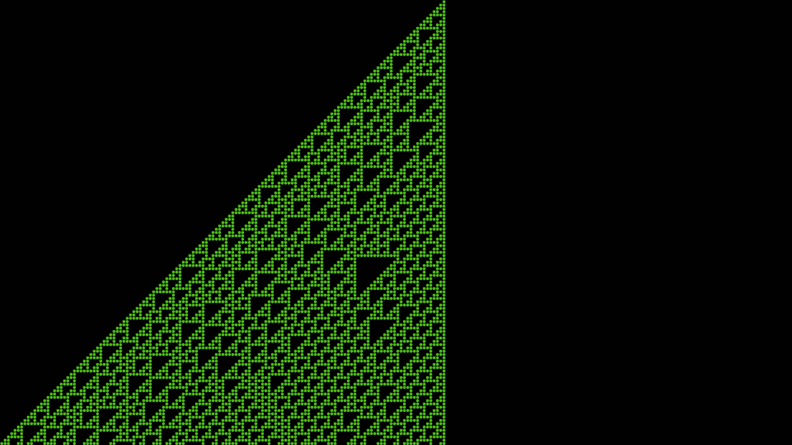

**All of [The Wolfram Elementary CA](https://en.wikipedia.org/wiki/Elementary_cellular_automaton) in one program.**

Input your desired rule and initial conditoin, then open the html file.

Press : 'r' to generate and 's' to stop generating.

**Rule 110**

**Rule 30**

**Rule 129**

**Rule 218**

